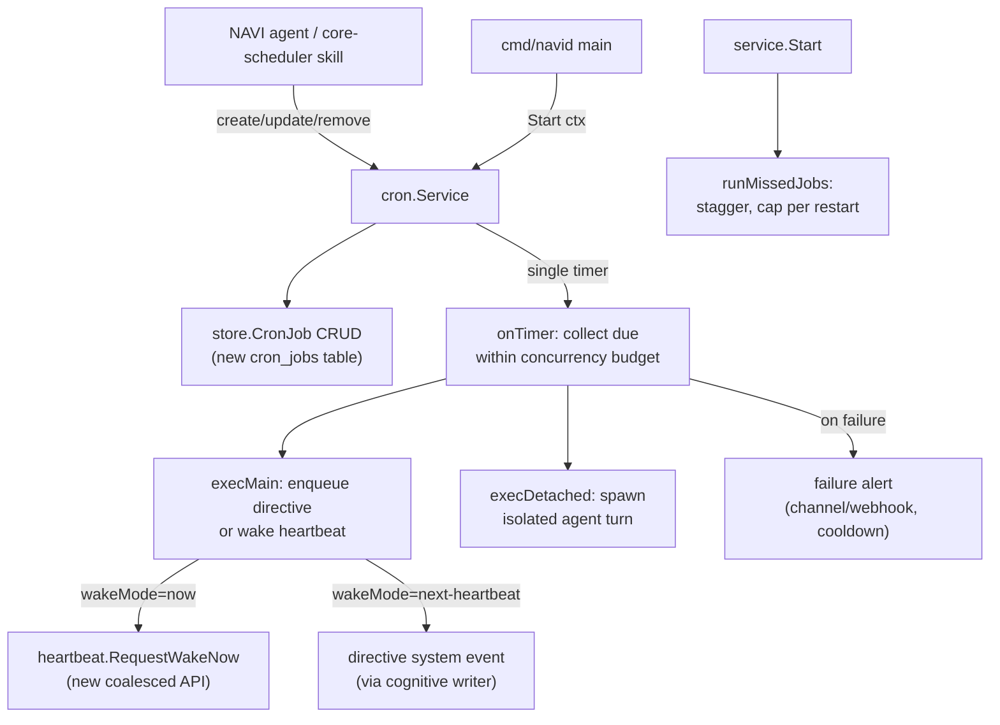

# Cron service overhaul

Build NAVI's missing "agentic time" foundation by porting OpenClaw's mature cron service to Go, replacing the minute-poll inline loop in [cmd/navid/main.go](cmd/navid/main.go) (lines 593–638). Adds the missing capabilities identified in the comparison: `at`/`every`/`cron` kinds, per-job timezone, transient-error backoff, startup catch-up with stagger, per-job timeout, failure alerts, and a coalesced "wake now" hook into the existing heartbeat.

## Architecture



## Package layout

- `internal/cron/types.go` — `Schedule` (sum type `kind: at|every|cron`), `Job`, `JobState`, `RunOutcome`, `RunStatus`, `WakeMode`, `Payload`, `Delivery`, `FailureAlert`. Mirror of [example-code/openclaw/src/cron/types.ts](example-code/openclaw/src/cron/types.ts) but Go-idiomatic.
- `internal/cron/schedule.go` — `ComputeNextRunAt`, `ComputePreviousRunAt`, per-kind dispatch. Reuse `github.com/robfig/cron/v3` (already in [go.mod](go.mod)) for `cron` kind; native math for `at`/`every`. Per-job timezone via `time.LoadLocation`.
- `internal/cron/stagger.go` — deterministic per-job offset from `sha256(jobID) % staggerMs` to spread top-of-hour fires. Port of [example-code/openclaw/src/cron/stagger.ts](example-code/openclaw/src/cron/stagger.ts).
- `internal/cron/backoff.go` — transient-error classifier (regex set for `rate_limit`/`overloaded`/`network`/`timeout`/`5xx`) and `errorBackoffMs([30s,60s,5m,15m,1h])`. Port of patterns in [example-code/openclaw/src/cron/service/timer.ts](example-code/openclaw/src/cron/service/timer.ts) lines 205–253.
- `internal/cron/service.go` — `Service` struct with deps (logger, DB, clock, `requestHeartbeatNow`, `enqueueSystemEvent`, `runIsolatedJob`, `sendFailureAlert`, `cronConfig`). Owns the single re-armed `*time.Timer`, the `running` flag, and the in-memory job snapshot. Public surface: `Start(ctx)`, `Stop()`, `Add/Update/Remove/List/Get`, `RunNow(id)`, `Status()`.
- `internal/cron/timer.go` — `armTimer`, `onTick`, `collectRunnable`, `runDueJob`, `applyJobResult`, `runMissedJobs`. Direct Go port of [example-code/openclaw/src/cron/service/timer.ts](example-code/openclaw/src/cron/service/timer.ts) with these guards:
  - `MIN_REFIRE_GAP_MS = 2*time.Second` to break tight re-fire loops.
  - `MAX_TIMER_DELAY = 60*time.Second` clamp so we always wake at least every minute (drift recovery + stuck-job detection).
  - `runningRecheck` timer armed while `running` is true so a long-running job can't silently kill the scheduler.
  - Per-tick `context.WithTimeout` per job from `Job.TimeoutMs` (default 5 min). On timeout, `cancel()` propagates to the executor.
- `internal/cron/executor.go` — two execution paths:
  - `executeMain`: target main session. If `WakeMode == now`, call new `heartbeat.RequestWakeNow(reason)`; on busy-lane skip, fall back to enqueueing a directive system event. If `WakeMode == next-heartbeat`, enqueue only.
  - `executeDetached`: spawn an isolated agent turn via injected `RunIsolatedJob` callback (Phase 16 — stub returning `skipped: "not yet implemented"` for now to keep scope bounded).

## Storage

New SQLite table (migration in [internal/store/db.go](internal/store/db.go)):

```sql
CREATE TABLE IF NOT EXISTS cron_jobs (
  id TEXT PRIMARY KEY,
  owner_id TEXT NOT NULL,
  name TEXT NOT NULL,
  description TEXT,
  enabled INTEGER NOT NULL DEFAULT 1,
  schedule_kind TEXT NOT NULL,           -- 'at' | 'every' | 'cron'
  schedule_expr TEXT,                    -- cron expr OR RFC3339 for 'at'
  schedule_every_ms INTEGER,             -- for 'every'
  schedule_anchor_ms INTEGER,            -- for 'every'
  schedule_tz TEXT,                      -- per-job timezone
  schedule_stagger_ms INTEGER,           -- for 'cron'
  session_target TEXT NOT NULL,          -- 'main' | 'isolated'
  wake_mode TEXT NOT NULL,               -- 'now' | 'next-heartbeat'
  payload_kind TEXT NOT NULL,            -- 'systemEvent' | 'agentTurn'
  payload_text TEXT NOT NULL,
  delivery_json TEXT,                    -- JSON blob: channel/account/thread/bestEffort
  failure_alert_json TEXT,               -- JSON blob: after/cooldown/channel/to/mode
  timeout_ms INTEGER,
  delete_after_run INTEGER NOT NULL DEFAULT 0,
  -- state:
  next_run_at_ms INTEGER,
  running_at_ms INTEGER,
  last_run_at_ms INTEGER,
  last_run_status TEXT,                  -- 'ok' | 'error' | 'skipped'
  last_error TEXT,
  last_duration_ms INTEGER,
  consecutive_errors INTEGER NOT NULL DEFAULT 0,
  schedule_error_count INTEGER NOT NULL DEFAULT 0,
  last_failure_alert_at_ms INTEGER,
  created_at_ms INTEGER NOT NULL,
  updated_at_ms INTEGER NOT NULL
);
CREATE INDEX IF NOT EXISTS idx_cron_jobs_enabled_next ON cron_jobs(enabled, next_run_at_ms);
```

CRUD lives in `internal/store/cron_jobs.go`: `InsertCronJob`, `UpdateCronJob`, `GetCronJob`, `ListCronJobs`, `DeleteCronJob`, `GetRunnableCronJobs(now)`. Uses raw SQL — no ORM — consistent with the rest of [internal/store/](internal/store/).

**Migration of legacy rows**: on first boot after upgrade, `cron.Service.Start` reads `scheduled_tasks` and inserts equivalents into `cron_jobs` (`schedule_kind='cron'`, `session_target='main'`, `wake_mode='next-heartbeat'`, `payload_kind='systemEvent'`, `payload_text=Prompt`). Leaves the old table intact for one release as a rollback safety net; the old poller is deleted in the same commit.

## Heartbeat integration (light-touch)

Extend [internal/navi/heartbeat/service.go](internal/navi/heartbeat/service.go) with a coalesced wake API — port of [example-code/openclaw/src/infra/heartbeat-wake.ts](example-code/openclaw/src/infra/heartbeat-wake.ts) (much smaller scope than full OpenClaw heartbeat):

- `RequestWakeNow(reason, opts)` — enqueues a pending wake keyed by `(agentID, sessionKey)`; coalesces to a single 250ms `time.AfterFunc`.
- Priority resolver (`RETRY > INTERVAL > DEFAULT > ACTION`) merges duplicate requests.
- The existing `runLoop` ticker stays; the new path lets cron trigger a tick out-of-cycle without a tight race.
- Skip if `dndEnabled` or quiet hours match.

Not in scope this round (callable follow-ups): hash-derived phase per agent, active-hours gate distinct from quiet hours, per-target busy-lane skip with retry.

## Wiring

In [cmd/navid/main.go](cmd/navid/main.go):

1. Replace the inline `go func() { ticker := time.NewTicker(time.Minute) ... }()` block (lines 593–638) with:
   ```go
   cronSvc := cron.NewService(cron.Deps{
       DB: db, Log: slog.Default(), Clock: time.Now,
       DirectiveWriter: directiveWriter,
       Heartbeat:       hbService, // optional
       CronConfig:      cfg.Cron,
   })
   if err := cronSvc.Start(ctx); err != nil { log.Fatalf("cron: %v", err) }
   defer cronSvc.Stop()
   ```
2. Update `internal/navi/skill/schedule_handler.go` to call `cronSvc.Add(...)` instead of `store.PersistScheduledTask` (inject the service through `RegisterScheduleHandler`'s signature). Old skill `schedule_task` continues to work; new optional args `kind`, `at`, `every_ms`, `timezone`, `wake_mode`, `timeout_ms` enable the new shapes.
3. Add `Cron` block to [internal/config/config.go](internal/config/config.go): `MaxConcurrentRuns`, `MissedJobStaggerMs`, `MaxMissedJobsPerRestart`, `Retry.MaxAttempts`, `Retry.BackoffMs`, `FailureAlert.{Enabled,After,CooldownMs}`, `DefaultTimeoutMs`. Defaults in [config/runtime.yaml](config/runtime.yaml).

## Tests (write before code per CLAUDE.md)

- `internal/cron/schedule_test.go` — table-driven for all three kinds incl. timezone edges, croner year-rollback workaround (mirror of [example-code/openclaw/src/cron/schedule.ts](example-code/openclaw/src/cron/schedule.ts) lines 117–137).
- `internal/cron/service_test.go` — fire-once `at`, recurring `every` anchor preservation, top-of-hour stagger, transient retry → success clears `consecutive_errors`, permanent error disables one-shot, `delete_after_run=true` removes row on ok.
- `internal/cron/timer_test.go` — `running` flag does not silently kill scheduler when a tick exceeds `MAX_TIMER_DELAY`, hot-loop guard (`MIN_REFIRE_GAP_MS`) breaks past-due refire, failure alert respects cooldown.
- `internal/cron/catchup_test.go` — `runMissedJobs` honors `MaxMissedJobsPerRestart` and staggers deferred ones.
- `internal/store/cron_jobs_test.go` — CRUD + `GetRunnableCronJobs` filters by `enabled` and `next_run_at_ms <= now`.
- `internal/navi/heartbeat/wake_test.go` — coalescing within 250ms window, priority merge, dedup per `(agentID, sessionKey)`.

## Out of scope (explicit)

- Detached/isolated-agent execution path (stubbed; revisit Phase 16 alongside non-file skill execution hardening).
- Heartbeat phase staggering, active-hours gate, per-channel delivery routing for cron output. Listed as follow-ups in the new `internal/cron/README.md` so we don't lose them.
- Removing the legacy `scheduled_tasks` table — one release of overlap for rollback.
