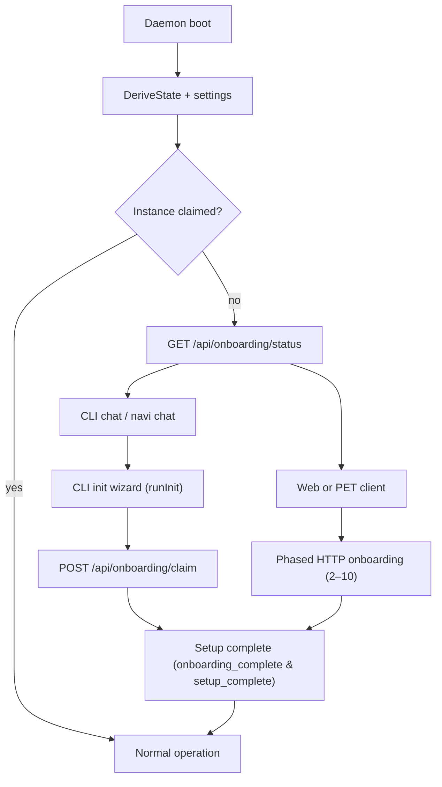

## Onboarding Flow

> **How a fresh NAVI instance is claimed, configured, and activated — across HTTP APIs, CLI, and the Wizard persona.**

This document describes the current onboarding flow for NAVI: how a brand‑new instance is claimed, how the first owner and API keys are created, and how the Wizard persona, CLI, and HTTP APIs cooperate to move the system into normal operation.

It is intended for contributors who need to reason about ownership, setup, and recovery, or who plan to extend the onboarding experience.

---

## Overview

At a high level, onboarding answers three questions:

- **Who owns this NAVI instance?** — a single **owner** record with an owner secret and primary API key.
- **How is the instance configured?** — security mode, connectors, model provider, and autonomy level.
- **How do we recover access?** — a recovery seed and owner‑secret–gated management APIs.

Onboarding is designed as a **one‑time, sequential wizard** flow with:

- A persistent **state machine** backed by SQLite `settings`.
- A **checkpoint file** on disk that stores staged configuration until activation.
- Two main UX entry points:
  - **CLI wizard** (`navi chat` / `navi init`) using `POST /api/onboarding/claim` and legacy `/api/setup/*`.
  - **Wizard persona + HTTP phases** using `/api/onboarding/status` and `/api/onboarding/phase/{2..10}`.

Once onboarding completes, the Wizard persona is retired from default flows and NAVI runs in **normal operation** with API‑key authentication.

For how these phases and states should be **represented in UI** (web, PET clients, CLI-adjacent messaging), see the [Onboarding UI Representation Guide](../design/onboarding-ui-guide.md).

---

## State Model and Settings

**Code reference:** `internal/onboarding/state.go`

Onboarding state is explicit and persisted. The core types are:

- **State** (`onboarding.State`):
  - `NOT_STARTED`, `IN_PROGRESS`, `AWAITING_CONFIRM`, `COMPLETE`, `CORRUPT`.
  - `State.IsComplete()` returns `true` only for `COMPLETE`.
  - `State.NeedsWizard()` is `true` for `NOT_STARTED`, `IN_PROGRESS`, and `AWAITING_CONFIRM`.
- **Phase numbers** (1–10, with 0 as boot routing):
  - `PhaseBoot` (0), `PhaseFirstContact` (1), `PhaseOwnerIdentity` (2), `PhaseOwnerSecret` (3),
    `PhaseSecurityMode` (4), `PhaseConnectors` (5), `PhaseModelProvider` (6),
    `PhaseFeatureConfig` (7), `PhaseRecovery` (8), `PhaseFinalConfirm` (9), `PhaseActivation` (10).

**Authoritative settings keys** (in the `settings` table, via `internal/store/settings.go`):

- `onboarding_state` — current `State` (`NOT_STARTED`, `IN_PROGRESS`, etc.).
- `onboarding_phase` — last completed phase number.
- `onboarding_complete` — `"true"` once the instance has been activated.
- `setup_complete` — `"true"` once setup is complete (used more broadly by agent runtime and setup tooling).
- `onboarding_mode` — `"true"` while the Wizard should be active and gating UX.

**Checkpointing**

**Code reference:** `internal/onboarding/checkpoint.go`

During the phased HTTP onboarding flow, NAVI writes a **checkpoint** file under:

- `navi/.onboarding/checkpoint.json` (relative to the configured data directory)

The checkpoint (`onboarding.Checkpoint`) stores staged values:

- Owner identity (`OwnerName`, `OwnerHandle`, `DeviceFingerprint`)
- Owner IDs and fingerprints (`OwnerID`, `InstanceID`, `OwnerSecretFingerprint`)
- Primary API key and recovery verification hashes (`PrimaryAPIKeyLast8Hash`, `SeedCheckHash`)
- Chosen configuration (`SecurityMode`, `Connectors`, `ModelProviderType`, `ModelProviderEndpoint`, `AutonomyLevel`, `RecoveryMethods`)
- Phase bookkeeping (`LastPhase`, `SeedVerified`, `APIKeyConfirmed`)

This file is **only deleted** once Phase 10 (activation) succeeds or when the instance is reset. Until then, it allows resuming onboarding without committing partial configuration.

---

## Daemon Boot and Wizard Gating

**Code reference:** `cmd/navid/main.go`, `internal/gateway/server.go`, `internal/gateway/middleware.go`

On daemon startup (`navid`):

1. SQLite is opened and migrations are run.
2. The effective **data directory** is determined (typically the directory containing the SQLite DB).
3. `onboarding.DeriveState(ctx, db, dataDir)` is called to compute:
   - Current `State` and the last completed phase.
   - Derived flags like `onboarding_mode`.
4. The results are persisted to `settings` (`onboarding_state`, `onboarding_phase`, `onboarding_mode`), and **first‑boot logs** are emitted if the instance is unclaimed or partially onboarded.

The gateway (`internal/gateway/server.go` and `internal/gateway/middleware.go`) then:

- Exposes **public onboarding routes**:
  - `GET /api/onboarding/status`
  - `POST /api/onboarding/claim`
  - `GET /api/onboarding/passport`
  - `POST /api/onboarding/phase/{2..8,8/confirm-seed,8/confirm-apikey,10}`
  - `GET /api/onboarding/phase/9`
- Exposes **legacy setup routes** that are public only while `setup_complete != "true"`:
  - `GET /api/setup`, `POST /api/setup/llm`, `POST /api/setup/connector`, `POST /api/setup/complete`.

When a **NAVI session** is created (`handleNaviCreateSession` in `internal/gateway/server.go`), the gateway:

- Re‑calls `onboarding.DeriveState`.
- If `state.NeedsWizard()` is `true`, forces the session experience mode to `wizard` (`navi.ExperienceModeWizard`), regardless of what the client requested.
- Otherwise, rejects unknown legacy fields and uses the standard NAVI experience profile when the request body is valid.

This is the primary **gating mechanism**: while onboarding is incomplete, all sessions are routed through the Wizard persona by default.

---

## HTTP Onboarding API

### Status, Claim, and Passport

**Code reference:** `internal/gateway/onboarding.go`

- **`GET /api/onboarding/status`** — public
  - Returns:
    - `claimed` — whether an owner record exists.
    - `onboarding_state` — current `State` as a string.
    - `last_phase` — last completed phase (int).
    - `onboarding_mode` — `true` while the Wizard should run.
    - `owner_name`, `instance_id`, `owner_secret_fingerprint` when an owner exists.
  - Used by:
    - CLI (`runSetupWizard` in `cmd/navi/main.go`) to decide whether to run the init wizard.
    - Web/PET clients to decide whether to show onboarding UI.

- **`POST /api/onboarding/claim`** — public, **one‑shot quick path**
  - Request body:
    - `owner_name` — display name (optional, defaults to `"Owner"`).
    - `owner_handle` — short handle (optional, auto‑derived from name).
    - `device_name` — optional client/device label.
    - `owner_secret` — optional owner secret; auto‑generated if omitted.
  - Behavior:
    - Fails with `409 Conflict` if an owner already exists.
    - Creates the owner record and stores a hashed owner secret.
    - Generates the primary API key with admin scopes.
    - Generates a recovery seed.
    - Sets `setup_complete="true"` and `onboarding_mode="false"`.
  - Response (Owner Passport):
    - Ownership metadata (owner ID, handle, instance ID, secret fingerprint).
    - `primary_api_key` / `api_key` and `key_id`.
    - `recovery_seed`.
    - Optional `admin_secret` when the server generated the owner secret.

- **`GET /api/onboarding/passport`** — requires `X-Owner-Secret`
  - Verifies the owner secret and returns a **non‑secret** passport view:
    - Owner identity and instance ID.
    - Secret fingerprint.
    - Count of active API keys.
  - Intended for management UIs to re‑display ownership information without exposing the primary key.

- **API key management (post‑onboarding)**
  - `POST /api/keys` — create additional API keys (owner secret required).
  - `GET /api/keys` — list active keys.
  - `DELETE /api/keys/{id}` — revoke a key.
  - These share the same `X-Owner-Secret` verification helper.

### Phased HTTP Onboarding (v2 Wizard Flow)

**Code reference:** `internal/gateway/onboarding_phases.go`

The v2 flow breaks onboarding into explicit HTTP phases that match the spec in `.cursor/plans/onboarding-flow-v2.md`:

1. **Phase 2 — Owner Identity**
   - `POST /api/onboarding/phase/2`
   - Inputs: `owner_name`, `owner_handle`, `device_fingerprint`.
   - Behavior:
     - Normalizes name/handle.
     - Creates or updates the checkpoint with identity fields.
     - Sets `LastPhase=PhaseOwnerIdentity`.
     - Calls `onboarding.SetState(..., StateInProgress, PhaseOwnerIdentity)`.

2. **Phase 3 — Owner Secret, Owner, Primary API Key, Recovery Seed**
   - `POST /api/onboarding/phase/3`
   - Inputs: optional `owner_secret`.
   - Behavior:
     - Requires an identity checkpoint from Phase 2 and no existing owner.
     - Generates or uses the owner secret; stores its fingerprint.
     - Creates the owner record and sets the owner secret hash in the DB.
     - Generates the **primary API key** and the **recovery seed**.
     - Updates the checkpoint with owner IDs, fingerprints, verification hashes, and `LastPhase=PhaseOwnerSecret`.
     - Sets `StateInProgress` with `PhaseOwnerSecret`.
     - Returns an `OwnerPassport` JSON (without owner secret).

3. **Phases 4–7 — Configuration (Checkpoint Only)**
   - `POST /api/onboarding/phase/4` — `security_mode` (`local_cli_only` default).
   - `POST /api/onboarding/phase/5` — `connectors` (e.g. `["cli"]` default).
   - `POST /api/onboarding/phase/6` — `model_provider_type`, `model_provider_endpoint`.
   - `POST /api/onboarding/phase/7` — `autonomy_level` (e.g. `"chat_assistant"` default).
   - Each phase:
     - Reads the checkpoint, validates that previous phase(s) ran.
     - Mutates configuration fields on the checkpoint.
     - Sets `LastPhase` to the current phase and updates `onboarding_state` to `IN_PROGRESS`.

4. **Phase 8 — Recovery Methods and Verification**
   - `POST /api/onboarding/phase/8`
     - Inputs: `recovery_methods` (e.g. `["seed", "owner_secret"]`).
     - Writes methods to the checkpoint, sets `LastPhase=PhaseRecovery`, state to `IN_PROGRESS`.
   - `POST /api/onboarding/phase/8/confirm-seed`
     - Inputs: `seed_check` — first 8 characters of the recovery seed.
     - Compares a hash against `SeedCheckHash` and sets `SeedVerified=true`.
   - `POST /api/onboarding/phase/8/confirm-apikey`
     - Inputs: `last_eight` — last 8 characters of the primary API key.
     - Compares a hash against `PrimaryAPIKeyLast8Hash` and sets `APIKeyConfirmed=true`.

5. **Phase 9 — Summary**
   - `GET /api/onboarding/phase/9`
   - Assembles a summary view from checkpoint + owner record:
     - Identity, instance ID.
     - Security mode, connectors, model provider, autonomy level.
     - Recovery methods and verification flags.

6. **Phase 10 — Activation**
   - `POST /api/onboarding/phase/10`
   - Behavior:
     - Ensures an owner exists; if no checkpoint exists, sets:
       - `onboarding_complete="true"`, `setup_complete="true"`, `onboarding_mode="false"`.
       - Returns `activated: true`.
     - If a checkpoint exists:
       - Writes a **genesis audit** entry to `settings["genesis_audit"]`.
       - Writes a **config snapshot** (`config.json` in the data dir) with:
         - Instance/owner IDs and handle.
         - Security mode, connectors, autonomy level.
         - `onboarding_complete=true`, `onboarding_version="2.0"`.
       - Deletes the checkpoint directory.
       - Sets `onboarding_complete="true"`, `setup_complete="true"`, `onboarding_mode="false"`.
       - Updates `onboarding_state` to `COMPLETE`, phase to `PhaseActivation`.

---

## CLI Onboarding Wizard (`navi`)

**Code reference:** `cmd/navi/main.go`

### Entry Points

- `navi` / `navi chat`:
  - Creates a `Config`, resolves CLI config from flags/env/file.
  - Calls `runChat`, which calls `runSetupWizard` **before** creating a session.
- `navi init`:
  - Calls `runInit` directly (optionally with `-quick`), bypassing chat.
- `navi ask`:
  - **Deliberately skips** `runSetupWizard` to avoid interactive prompts; relies on the gateway to reject requests if onboarding is incomplete.

### `runSetupWizard`: Status‑Driven Behavior

`runSetupWizard` implements a small decision tree:

1. `GET /api/onboarding/status`.
2. If the request fails or the response cannot be decoded, it **silently returns**, letting chat proceed (useful while the daemon is booting).
3. If `status.claimed == true` and `cfg.APIKey != ""`, it returns — onboarding already completed and local config has an API key.
4. If `status.claimed == true` and `cfg.APIKey == ""`, it:
   - Prompts the user to paste an API key.
   - Saves it to `~/.navi/config.json`.
5. If `status.claimed == false`, it calls `runInit` to perform first‑boot setup.

### `runInit`: Phases 1–3.5 (+ Recovery and Optional Config)

`runInit` is the core CLI onboarding wizard:

- **Phase 1 — First Contact**
  - Prints a short introduction and explains ownership semantics.
  - If not in quick mode (`quick == false`), asks **“Would you like to begin setup?”**.
  - Aborts the process if the user declines.

- **Phase 2 — Owner Identity**
  - Prompts for `ownerName` (“What should I call you?”).
  - Optionally prompts for a short handle; auto‑generates one if empty.

- **Phase 3 — Owner Secret**
  - Explains the role of the owner secret (break‑glass, not for daily use).
  - Optionally accepts a user‑provided secret; otherwise it will be generated by the server.

- **Claim Request**
  - Builds a JSON body with `owner_name`, `owner_handle`, and `owner_secret`.
  - `POST /api/onboarding/claim`.
  - Handles:
    - `409 Conflict` — prints a message that the instance was already claimed.
    - Non‑`201 Created` — surfaces the raw error body.

- **Phase 3.5 — Passport**
  - Decodes the response into a passport struct containing:
    - Owner and instance metadata.
    - `primary_api_key` and `recovery_seed`.
  - Prints a decorated **“Owner Passport”** block with the key and seed.
  - Writes:
    - `cfg.APIKey = primary_api_key`.
    - `cfg.OwnerSecret = ownerSecret` (if user provided one).
    - Local CLI config to `~/.navi/config.json`.

- **Recovery Reminder (Phase 8 analogue)**
  - Repeatedly prompts the user until they confirm that the recovery seed has been stored safely.

- **Optional Phases 4–6 — LLM And Connectors**
  - If not in quick mode, calls `setupOptionalConfig`, which:
    - Asks for **instance security mode**, stores a local label (no direct DB setting).
    - Optionally configures the Telegram connector via `POST /api/setup/connector`.
    - Optionally configures an AI provider via `POST /api/setup/llm`.
    - Prints a summary and pseudo‑“activation” messages, then saves the updated CLI config again.

The CLI wizard therefore:

- Uses **`POST /api/onboarding/claim`** for ownership and API key issuance.
- Uses **legacy `/api/setup/*`** endpoints for connectors and LLM setup, rather than the v2 phased onboarding APIs.

---

## Wizard Persona and Onboarding Skill

**Code reference:** `docs/concepts/onboarding-experience.md`, `internal/navi/experience/defaults.go`, `config/skills/onboarding/SKILL.yaml`, `internal/navi/config.go`, `internal/navi/loop.go`

### Wizard Persona

The **Wizard** persona is a dedicated, setup‑only persona:

- Defined in `config/personas/wizard.yaml`.
- Documented in `docs/concepts/onboarding-experience.md` (role and boundaries) and `docs/concepts/wizard-config-flows.md` (post-onboarding configuration flows).
- Activated automatically whenever `onboarding.State.NeedsWizard()` is `true` and a client creates a session.

The Wizard prompt is structured into **10 phases** (Welcome, Identity, Owner Secret, Security Mode, Connectors, Model Provider, Autonomy Level, Recovery, Confirmation, Complete) and includes strict rules:

- One phase per response; do not advance until the current phase is confirmed.
- No persona selection during onboarding.
- At Phase 10, after confirmation, the Wizard must say exactly:
  - **“Setup complete. You are now my owner.”**
  - And call the `onboarding_set_setup_complete` tool.

### Onboarding Skill: `onboarding_set_setup_complete`

The onboarding skill is defined in `config/skills/onboarding/SKILL.yaml` as:

- Skill ID `onboarding`.
- Interface `set_setup_complete` taking a `{ confirmed: bool }` payload.
- Exposed to the LLM as the **tool** `onboarding_set_setup_complete`.

In the agent runtime:

- `internal/navi/config.go` adds two hooks to `navi.Config`:
  - `IsSetupDone(ctx)` — used to check whether setup has completed.
  - `OnSetupComplete(ctx)` — host callback invoked to **persist setup completion**.
- `internal/navi/loop.go` special‑cases tool execution:
  - When the tool name is `"onboarding_set_setup_complete"`, it calls `OnSetupComplete`.
  - In the daemon, `OnSetupComplete` writes `setup_complete="true"` to SQLite and may perform any additional bookkeeping.

This mechanism ensures that, even when the Wizard persona is driving onboarding from a **chat session**, setup completion is **persisted by the host** and recognized by future boots and session creations.

The HTTP Phase 10 handler already sets `onboarding_complete`, `setup_complete`, and `onboarding_mode=false` and writes snapshots; the skill is effectively a belt‑and‑suspenders hook from the agent layer.

---

## Post‑Onboarding Behavior and Reset

### Normal Operation

Once onboarding completes (via CLI claim or full v2 wizard):

- `onboarding_state` is set to `COMPLETE` and `onboarding_phase` to `PhaseActivation` (10).
- `onboarding_complete="true"` and `setup_complete="true"`.
- `onboarding_mode="false"`, so:
  - `State.NeedsWizard()` returns `false`.
  - New sessions are **not** forced to the Wizard persona.
  - Public clients create standard sessions without selecting a persona.
  - Legacy persona defaults remain an internal compatibility detail during migration.

Gateway behavior changes accordingly:

- `/api/setup/*` is now **auth‑protected** via `AuthMiddleware`.
- `POST /api/onboarding/claim` returns `409 Conflict` because an owner already exists.
- `/api/onboarding/status` continues to work, but will report `claimed=true` and `onboarding_state="COMPLETE"`.

User‑facing docs such as `README.md` and `docs/FEATURES.md` emphasize that:

- The first run launches an interactive setup wizard.
- Settings (including the primary API key) are persisted, and the wizard does not re‑run unless the instance is reset.

### Resetting the Instance

**Code reference:** `internal/gateway/instance.go`

The gateway exposes an owner‑only endpoint to **reset** the instance:

- `POST /api/instance/reset`
  - Authenticated via `X-Owner-Secret`.
  - Wipes the database and JetStream streams.
  - Deletes the onboarding checkpoint directory via `onboarding.DeleteCheckpoint(dataDir)`.

After a reset:

- `onboarding.DeriveState` will once again return `NOT_STARTED`.
- `GET /api/onboarding/status` will report `claimed=false` and `onboarding_mode=true`.
- The next client that connects (CLI or web) will see an **unclaimed** instance and can run onboarding again.

---

## Observations, Issues, and Opportunities

### Implementation Notes

- There are **two overlapping onboarding paths**:
  - The **quick CLI path** (`POST /api/onboarding/claim` + optional `/api/setup/*`).
  - The **full v2 phased HTTP path** (`/api/onboarding/phase/{2..10}` with checkpoint + config snapshot).
- Skill execution is no longer broadly mocked. `onboarding_set_setup_complete` remains a special host callback, but the runtime also ships real `internal`, `rest`, `mcp_tool`, and `subprocess_python` execution paths.
- Web UI support is currently minimal (`web/index.html` placeholder). The v2 phased API and Wizard persona are ready for a richer front‑end, but no full browser wizard exists yet.

### Potential Issues and Inconsistencies

- Some aspects of the **v2 spec** (e.g., idle timeouts, richer quick‑setup modes) may not be fully implemented in Go yet; behavior should be compared against `.cursor/plans/onboarding-flow-v2.md` before making assumptions.
- Connectors and LLM configuration are split:
  - CLI uses legacy `/api/setup/*` endpoints and local labels for security mode.
  - The v2 phased API snapshots connectors and autonomy level into `config.json`.
- Both HTTP Phase 10 and the Wizard’s `onboarding_set_setup_complete` tool can influence perceived setup completion; their responsibilities should remain clearly separated (HTTP for config snapshot & audit, tool for agent‑layer awareness).

### Opportunities for Improvement

- **Unify configuration flows**:
  - Move connector and LLM setup fully onto the v2 phased HTTP onboarding APIs, and have both CLI and web clients drive those phases.
- **Strengthen tests**:
  - Add coverage for onboarding restarts, checkpoint corruption, and reset flows.
- **Enhance the web wizard**:
  - Implement a dedicated front‑end that drives phases 2–10 and surfaces recovery confirmations and summary/activation screens.

---

## Maintenance

When you change any of the following, **update this document** alongside your code and tests:

- Onboarding states, phases, or `settings` keys.
- HTTP routes under `/api/onboarding/*` or `/api/setup/*`.
- Wizard persona behavior or the `onboarding_set_setup_complete` skill.
- Ownership or recovery semantics (owner secret, recovery seed, API key handling).

This file is the canonical reference for NAVI’s onboarding behavior and should stay in sync with both the Go implementation and the v2 onboarding spec.

---

## High‑Level Flow Diagram

