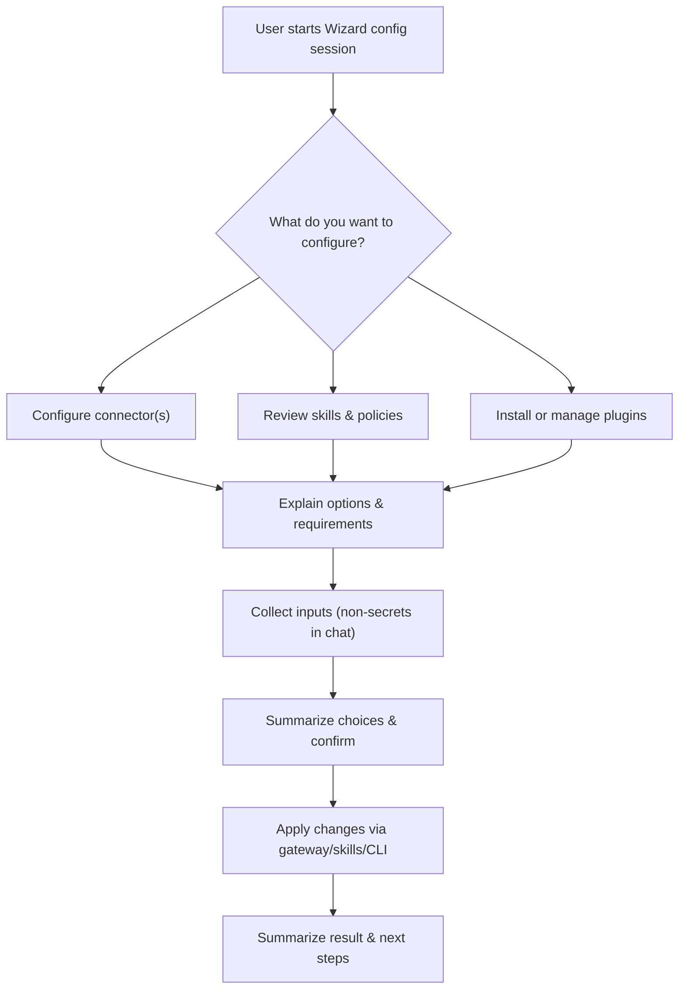

## Wizard Configuration Flows

> **How the Wizard persona assists with configuration beyond first-time onboarding — connectors, skills, and plugins.**

This document describes how the Wizard persona can act as a guided, conversational interface for **configuration tasks after the initial instance onboarding** is complete.

It is intended for contributors designing new Wizard-driven flows (e.g., connector setup) or extending existing ones, and should be read alongside:

- [docs/concepts/onboarding-flow.md](onboarding-flow.md) — first-time instance claim and activation.
- [docs/concepts/onboarding-experience.md](onboarding-experience.md) — Onboarding Experience's core role, interaction style, and boundaries.
- [docs/concepts/skills.md](skills.md) — the skills system that backs many configuration capabilities.

---

## Scope and Relationship to Onboarding

- **First-time onboarding**:
  - Fully documented in [onboarding-flow.md](onboarding-flow.md).
  - One-time, linear sequence: owner claim, recovery, security/autonomy choices, activation.
  - Wizard is auto-forced while `onboarding_state` is not `COMPLETE` (`State.NeedsWizard() == true`).
- **Wizard configuration flows (this doc)**:
  - Cover how Wizard can be deliberately invoked **after onboarding** to help with:
    - Connector setup and updates (e.g., Telegram).
    - Skill discovery and enable/disable decisions.
    - Plugin/module installs via a future marketplace.
  - Wizard is **not forced by default** once onboarding is complete; configuration sessions should be explicitly started via dedicated setup or admin commands.

The key design goal is to reuse Wizard’s **step-by-step, completion-focused** style for later configuration, without turning it into a general-purpose admin console.

---

## Wizard’s Configuration Responsibilities

Wizard’s configuration responsibilities can be summarized as:

- **Guided setup**:
  - Help users configure **connectors** (Telegram today; other connectors in the future) by explaining prerequisites and orchestrating the necessary gateway calls.
  - Guide users through choosing and adjusting **security and autonomy levels** (at a conceptual level; concrete persistence still lives in gateway/state).
- **Skill and plugin awareness**:
  - Introduce higher-level capabilities (skills, plugins, modules) and explain what they do.
  - Help owners decide whether to **enable**, **disable**, or **install** higher-risk capabilities, especially for flows that affect external systems.
- **Guardrails**:
  - Enforce the same constraints defined in [onboarding-experience.md](onboarding-experience.md) and the Experience Layer defaults:
    - Setup/config only, one configuration task at a time.
    - No persona selection, no general chat.
    - Explain first, then ask for a decision, then summarize and confirm.

Wizard should remain **narrowly focused** on configuration journeys, not day-to-day operations or arbitrary state changes.

---

## Configuration Surfaces Wizard Can Drive

### Connectors

Wizard can front existing connector setup mechanisms by:

- Explaining, in plain language, what a connector does and what is required:
  - For Telegram: Bot Token and owner Chat ID, matching [docs/runbooks/connector-setup-telegram.md](../runbooks/connector-setup-telegram.md).
- Collecting any **non-secret** information conversationally (e.g., “Which connector do you want to enable?”).
- Orchestrating calls to the gateway to persist configuration and start connectors:
  - Today this is typically via `/api/setup/connector` (legacy setup backend).
  - Future flows may use dedicated onboarding or connector-specific endpoints under `/api/onboarding/phase/*` or `/api/connectors/*`.

**Security posture:**

- Secrets (tokens, passwords) should, where possible, be collected **outside the LLM**:
  - Via CLI prompts (like `/connect telegram`).
  - Via browser forms or MCP tools that handle secrets directly.
- Wizard can still:
  - Explain what secret values are needed and why.
  - Confirm that the required fields have been provided through the appropriate non-LLM channel.
  - Trigger non-secret operations (e.g., enabling a connector after secrets are stored).

### Skills

Per [docs/concepts/skills.md](skills.md), skills define capabilities such as:

- Web search.
- GitHub PR review.
- Summarization.

Wizard can assist with **awareness and gating**:

- **Discover**:
  - Summarize the current `SkillSnapshot` (as built from `internal/navi/skill/loader.go`), grouped by capability or risk.
- **Audit / review**:
  - Walk an owner through high-risk skills, highlighting:
    - `effects.risk_tier`.
    - Sensitive `security.data_access` (e.g., PII or secrets).
    - Declared `security.sandbox.network_egress`.
- **Enable / disable (conceptual)**:
  - Guide decisions on which skills should be available in a given workspace or context.
  - Actual toggles will depend on future implementation (e.g., workspace-level skill allowlists), but Wizard can still:
    - Capture the owner’s intent.
    - Propose or apply appropriate configuration once mechanisms exist.

**Current limitation:**

- All skills except `onboarding_set_setup_complete` still execute in a **mock** fashion. Wizard can plan and record decisions, but actual behavior changes may be limited until real execution paths are wired in.

### Plugins and Modules (Future-Facing)

The Skills doc outlines a future **NAVI Net** / marketplace model:

- Discover skills/modules via `navi-net`.
- Review permissions and effects before install.
- Install via `navi-net install`.

Wizard can become the conversational front-end for this by:

- Helping users **search** for modules by purpose.
- Explaining each module’s:
  - Declared effects.
  - Security and sandbox constraints.
  - Required permissions.
- Asking for explicit **install / do not install** decisions.
- Orchestrating:
  - Calls to a future `navi-net` skill/tool to perform install, or
  - Guiding the user to run the right CLI command with the correct arguments.

---

## Example Flows

### 1. Telegram Connector Setup via Wizard

High-level story:

1. **Intent**:
   - Owner starts a Wizard session (after onboarding) and says: “Help me connect Telegram.”
2. **Explain**:
   - Wizard explains what the Telegram connector does and what is required:
     - Bot Token from `@BotFather`.
     - Owner Chat ID from `@userinfobot`.
   - Wizard points to the same requirements as in [connector-setup-telegram.md](../runbooks/connector-setup-telegram.md).
3. **Collect**:
   - Wizard either:
     - Directs the user to a non-LLM UI (CLI or web form) to enter the token and Chat ID, or
     - Uses a dedicated, strongly-typed tool interface for secrets if available.
4. **Apply**:
   - Once secrets are stored, Wizard triggers the same gateway API that `/connect telegram` uses:
     - Equivalent to `POST /api/setup/connector` with type `telegram` and params `bot_token` and `owner_chat_id`.
5. **Confirm**:
   - Wizard confirms the connector is active and suggests a simple test:
     - “Send `/ping` to your bot; I should respond within a few seconds.”

This pattern can be reused for other connectors (Slack, Signal, WhatsApp) as those backends and endpoints are implemented.

### 2. Enabling a High-Risk Skill

Example journey:

1. **Intent**:
   - Owner tells Wizard: “Review what high-risk skills I have and which ones you recommend enabling.”
2. **Explain**:
   - Wizard uses skill metadata to identify high-risk skills:
     - `effects.risk_tier == "high"` or `effects.requires_confirmation == true`.
     - `security.data_access` indicating PII or secrets.
   - Wizard explains each candidate skill briefly and highlights why it is considered high-risk.
3. **Collect decisions**:
   - For each skill, Wizard asks:
     - “Enable this skill?”, “Disable it?”, or “Ask for confirmation each time?”
4. **Apply / record**:
   - Depending on implementation:
     - Apply decisions via workspace or instance-level configuration (e.g., an allowlist).
     - Or record decisions for a human operator to codify in configuration files or policy.
5. **Summary**:
   - Wizard summarizes the new policy:
     - “You enabled: A, B; disabled: C; require confirmation for: D, E.”

Even before real enforcement exists, this can serve as a **policy planning** flow, giving a clear shape to future configuration mechanisms.

### 3. Installing a Plugin from a Marketplace (Forward-Looking)

Example journey, aligned with `navi-net` concepts:

1. **Intent**:
   - Owner: “Install a GitHub PR review module.”
2. **Search**:
   - Wizard calls a `navi-net` search tool or presents pre-discovered modules such as:
     - `navi.github.pr-review@1.2.0`.
3. **Explain**:
   - Wizard surfaces key details:
     - Description (e.g., “Reviews GitHub pull requests and posts structured feedback”).
     - Effects (writes to GitHub).
     - Required scopes (e.g., `repo`, `pull_request`).
     - Network egress hosts.
4. **Confirm**:
   - Wizard asks if the owner wants to install, restating the implications.
5. **Apply**:
   - Wizard either:
     - Invokes a `navi-net` install skill/tool to perform the installation, or
     - Guides the owner to run `navi-net install navi.github.pr-review@1.2.0` in the terminal.
6. **Post-install check**:
   - Wizard confirms the module is now available and suggests a simple test scenario.

---

## Lifecycle: Onboarding vs Later Configuration

Wizard appears in two distinct lifecycle phases:

- **During onboarding**:
  - Automatically forced for all sessions while `State.NeedsWizard()` is true.
  - Responsible for completing onboarding phases and calling `onboarding_set_setup_complete`.
- **After onboarding**:
  - Not forced by default; normal sessions use the default persona (Jarvis/Buddy/Orchestrator as configured).
  - Wizard should be **explicitly invoked** when needed:
    - PET clients choose `"wizard"` as the persona for a configuration session.
    - Future admin commands or UI actions can start a “Wizard config session” focused on a specific task.

Design principle:

- Use Wizard for **focused configuration sessions** (connectors, skills, plugins), not as a general admin shell or routine chat persona.

---

## UX and Safety Patterns for Wizard-Driven Config

When designing Wizard-driven config flows, follow these patterns:

- **One domain per conversation**:
  - Keep each session focused on a single configuration goal:
    - “Set up Telegram.”
    - “Review and tune high-risk skills.”
    - “Install and configure a GitHub module.”
- **Explain-before-ask**:
  - Briefly explain what a connector/skill/plugin does and what data it needs before prompting for any values.
- **Echo and confirm**:
  - Summarize user choices (without echoing full secrets) before committing changes.
  - Example: “Connector: Telegram; Autonomy: Assistive Agent; Skills: web-search enabled, github-pr-review requires confirmation.”
- **Separation of secrets**:
  - When feasible, gather secrets via non-LLM paths (CLI prompts, dedicated web forms, MCP tools) and let Wizard orchestrate the flow around them.
- **Auditability**:
  - Configuration changes (especially connectors and installs) should be logged via existing or future event logging mechanisms (e.g., `internal/store/eventlog.go`), so that Wizard-driven changes are traceable.

These patterns mirror the onboarding style: structured, transparent, and safety-first.

---

## Cross-Links and Discoverability

- **From docs index**:
  - `docs/README.md` lists this document under Concepts as “Wizard Configuration Flows”.
- **From onboarding-experience.md**:
  - The Wizard persona doc links here as the deeper reference for configuration flows involving connectors, skills, and plugins.
- **From onboarding-flow.md**:
  - The Wizard section in the onboarding doc can mention this file as the place where **post-onboarding Wizard behavior for configuration** is described.

---

## Maintenance

Update this document whenever:

- New Wizard-driven configuration flows are added for connectors, skills, or plugins.
- The way Wizard is invoked for configuration changes (e.g., new PET commands, CLI flags, or UI entry points).
- Security, secret-handling, or audit patterns for Wizard-driven config are updated.

Detailed first-time onboarding mechanics (owner claim, recovery, activation) remain in [onboarding-flow.md](onboarding-flow.md) to avoid duplication.

---

## Configuration Flow Diagram

