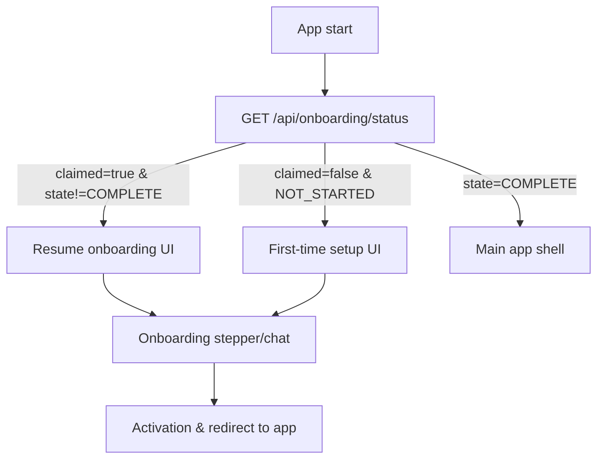

## Onboarding UI Representation Guide

> **Design and implementation-agnostic guidance for representing NAVI’s onboarding flow across web, PET clients, and CLI-adjacent UX.**

This guide maps the backend onboarding flow (state machine, phases, Onboarding Experience, CLI behavior) into **UI patterns** so that all clients present a consistent, secure, and understandable onboarding experience.

Read this alongside:

- [docs/concepts/onboarding-flow.md](../concepts/onboarding-flow.md) — canonical behavior of the onboarding engine.
- [docs/concepts/onboarding-experience.md](../concepts/onboarding-experience.md) — Onboarding Experience’s role and constraints.
- [docs/concepts/wizard-config-flows.md](../concepts/wizard-config-flows.md) — post-onboarding setup configuration flows.

---

## 1. Purpose and Audience

- **Purpose**:
  - Turn the onboarding spec from [onboarding-flow.md](../concepts/onboarding-flow.md) into concrete **UI expectations**: what steps to show, how to transition between them, and how to handle edge cases.
  - Stay **framework-agnostic**: this guide applies to web, PET desktop/mobile apps, and informs CLI messaging without dictating specific libraries.
- **Audience**:
  - **Product designers** defining flows, copy, and interaction.
  - **Frontend engineers** building web and PET onboarding UIs.
  - **CLI owners** keeping terminal prompts aligned with the same mental model.

---

## 2. Backend Model in UI Terms

At a high level, onboarding is defined by:

- **States** (from [onboarding-flow.md](../concepts/onboarding-flow.md)):
  - `NOT_STARTED`, `IN_PROGRESS`, `AWAITING_CONFIRM`, `COMPLETE`, `CORRUPT`.
- **Phases 1–10**:
  - 1: First Contact.
  - 2: Owner Identity.
  - 3: Owner Secret (and primary API key + recovery seed).
  - 4: Security Mode.
  - 5: Connectors.
  - 6: Model Provider.
  - 7: Autonomy Level.
  - 8: Recovery Methods & Confirmation.
  - 9: Summary.
  - 10: Activation.
- **Key flags from `/api/onboarding/status`**:
  - `claimed` (whether an owner exists).
  - `onboarding_state` and `last_phase`.
  - `onboarding_mode` (whether the Onboarding Experience should be active).

During onboarding:

- The **Onboarding Experience** is the exclusive interface:
  - Step-by-step, short responses, no persona selection.
  - Enforced by the gateway while `State.NeedsWizard()` is true.

UI should treat `GET /api/onboarding/status` as the **single source of truth** for deciding which onboarding view to show on startup.

---

## 3. UX Principles for Onboarding UIs

All onboarding UIs (web, PET, CLI-adjacent) should follow these principles:

- **Single clear goal per screen**:
  - Each phase maps to a focused screen or view (e.g., identity, secret, connectors), not a dense multipurpose form.
- **Progress visibility**:
  - Show where the user is in the 10-phase journey:
    - Use a progress bar or stepper labeled with human-readable phase names.
- **State resilience**:
  - On refresh or app restart, call `/api/onboarding/status` (and `GET /api/onboarding/phase/9` if needed) to **resume at the correct step** rather than restarting from the beginning.
- **Tone and copy alignment with Onboarding Experience**:
  - Copy should be brief, direct, and warm, consistent with the Experience Layer's onboarding defaults:
    - No persona selector.
    - No references to Orchestrator/Buddy/Jarvis during onboarding.
- **Security clarity**:
  - Make recovery and owner secret semantics obvious:
    - Mask sensitive values by default.
    - Provide clear “copy” affordances.
    - Use prominent, non-alarming warnings about storing secrets and recovery seeds safely.

---

## 4. Mapping Backend State and Phases to UI

### 4.1 Onboarding Entry Routing

Use `claimed` and `onboarding_state` from `/api/onboarding/status` to choose the entry path:

- `claimed=false` and `onboarding_state=NOT_STARTED`:
  - Show a dedicated **“First-time setup”** experience:
    - No login form.
    - No persona picker.
- `claimed=true` and `onboarding_state!=COMPLETE`:
  - Show a **“Resume setup”** flow:
    - Indicate that onboarding is in progress or awaiting confirmation.
    - Provide context about what remains (e.g., “2 steps left before activation”).
- `onboarding_state=COMPLETE`:
  - Skip onboarding-specific UI:
    - Route directly to the main app shell.
    - Offer an explicit “Open Setup Guide” or “Configuration Assistant” entry for post-onboarding configuration flows.

### 4.2 Per-Phase UI Expectations

For each phase, UIs should provide at least:

- **Phase 1 — First Contact**:
  - Welcome screen with:
    - Two–three short lines: what NAVI is, what onboarding will do, that this is a one-time setup.
    - A primary “Begin setup” button.
- **Phase 2 — Owner Identity**:
  - Inputs for name and handle:
    - Live feedback or a preview of how the handle will be normalized.
    - Clear indication that this handle will be used for owner-facing labels.
- **Phase 3 — Owner Secret**:
  - Explicit choice:
    - “Generate a secure owner secret for me” (recommended).
    - “I’ll provide my own secret”.
  - Strong but concise explanation:
    - What the owner secret is for (break-glass, privileged actions).
    - That day-to-day access uses API keys, not this secret.
- **Phases 4–7 — Security, Connectors, Model Provider, Autonomy**:
  - One screen per category:
    - Security Mode: radio choices with clear trade-off descriptions.
    - Connectors: optional toggles or checkboxes per connector, with short explanations.
    - Model Provider: choose provider, enter necessary fields (URL, model name) or skip.
    - Autonomy: three options (e.g., “Chat assistant”, “Assistive agent”, “Autonomous assistant”) with one-line descriptions.
- **Phase 8 — Recovery**:
  - Show recovery seed and explain its importance:
    - Provide a strong CTA to store the seed.
    - Include a clear acknowledgment control (checkbox or button) such as “I have stored this safely”.
  - If verifying via seed/API key snippets:
    - Provide simple form fields to enter required characters, with inline validation feedback.
- **Phase 9 — Summary**:
  - Read-only overview grouped into sections:
    - Owner identity.
    - Security and connectors.
    - Model provider.
    - Autonomy and recovery settings.
  - Optional “Edit” links that take the user back to the relevant phase screen.
- **Phase 10 — Activation**:
  - Final confirmation + short status view:
    - “Activating your NAVI instance…” with a brief description of what’s happening (e.g., writing config, recording audit).
  - On success:
    - Redirect to main app shell or a “Welcome” screen with first steps.

### 4.3 Edge States

- **`AWAITING_CONFIRM`**:
  - Skip ahead to a summary-like view and present a clear **“Confirm and activate”** CTA.
- **`CORRUPT`**:
  - Show a safe recovery state:
    - Non-technical explanation that setup data is inconsistent.
    - Offer a “Retry” if appropriate and a “Reset setup” option only when clearly safe and properly authorized.
    - Provide a path to support/documentation.

---

## 5. UI Patterns for the Onboarding Experience

The Onboarding Experience's presence should be visible in UI, but not overbearing:

- **Chat vs form hybrid**:
  - Recommended pattern:
    - A chat transcript area where Onboarding Experience messages appear.
    - A structured form area for **the current phase’s inputs**, with:
      - Labels and placeholders aligned with the Onboarding prompts.
  - Alternative:
    - A stepper/modal UI where Wizard copy appears above the controls as phase-specific guidance.
- **Message constraints**:
  - UIs should encourage outputs consistent with the Onboarding module:
    - Short messages (under ~100 words).
    - Exactly one phase per response.
    - No persona selection; no links to general conversational modes.
- **Error and retry behavior**:
  - For validation errors (e.g., invalid handle), show:
    - Inline error text near the relevant field.
    - A short Onboarding Experience message explaining what went wrong.
  - For technical errors (e.g., network issues), show:
    - Generic non-technical message.
    - A direct “Retry” action that re-submits the phase request.

Onboarding Experience copy in the UI must **not contradict** the role and rules described in [onboarding-experience.md](../concepts/onboarding-experience.md).

---

## 6. Status-Driven Behavior and Resume

All clients should follow a common pattern for status and resume:

- **Initial load**:
  - On app start:
    - Call `GET /api/onboarding/status`.
    - Use the routing logic in section 4.1 to choose:
      - First-time onboarding.
      - Resume onboarding.
      - Normal app shell (post-onboarding).
- **Resume logic**:
  - Use `last_phase` (and, if necessary, `GET /api/onboarding/phase/9`) to:
    - Reconstruct what steps have been completed.
    - Show the correct screen as the starting point, not always the welcome step.
- **In-flight operations**:
  - While calling phase endpoints:
    - Show a progress indicator and prevent duplicate submissions.
    - Avoid losing input if requests fail; keep data in memory until save is confirmed.

This is especially important for PET clients where app suspends/resumes are common.

---

## 7. Cross-Surface Consistency (Web, PET, CLI-Adjacent)

Ensure the onboarding experience feels coherent across surfaces:

- **Web and PET clients**:
  - Use the same **step structure and naming**:
    - Even if layouts differ, users should recognize the journey (“Identity”, “Secret”, “Recovery”, etc.).
  - PET (desktop/mobile) specifics:
    - Optimize for smaller screens:
      - Vertical steppers instead of wide horizontal ones.
      - Text truncation rules that preserve meaning.
    - Handle offline/poor connectivity:
      - Show cached progress where safe.
      - Clearly indicate when the backend has not yet confirmed a step.
- **CLI**:
  - `navi init` and `runSetup` are inherently text-based, but:
    - Prompts should mirror phase semantics (and ideally names) used in graphical UIs.
    - Any major changes to copy or sequencing in UI should be mirrored in CLI prompts to keep mental models aligned.

---

## 8. Accessibility and Internationalization

### Accessibility

Onboarding is a critical flow and must be accessible:

- Full **keyboard navigability** across all controls and dialogs.
- Clear **focus states** and logical tab order.
- Sufficient **contrast** for text and key UI elements, especially warnings and CTA buttons.
- Descriptive **error messages** associated with the relevant inputs (ARIA attributes where applicable).

### Internationalization

- Keep core messages **short and translatable**:
  - Avoid dense or idiomatic text in critical steps like secret/recovery instructions.
- Avoid culture-specific metaphors and references in onboarding copy.
- Design layouts to tolerate longer translated strings without breaking structure.

---

## 9. Error Handling and Recovery UX

Onboarding UIs must be resilient to failures:

- **API errors** (`4xx` / `5xx` from `/api/onboarding/*`):
  - Show concise, user-friendly messages.
  - Keep detailed error payloads in logs or devtools, not in the main UI.
- **Inconsistent backend state** (e.g., checkpoint missing but owner exists):
  - Follow guidance from [onboarding-flow.md](../concepts/onboarding-flow.md):
    - Offer a safe “Retry” when appropriate.
    - Expose a “Reset setup” option only to authorized users (e.g., via owner-authenticated flows).
    - Clearly warn about implications of reset (data loss, re-onboarding, etc.).
- **Connection issues**:
  - Show a clear offline or “Can’t reach NAVI” state, especially for PET:
    - Provide a “Retry” action.
    - Indicate that **backend state is authoritative** once connectivity returns, so progress indicators may adjust.

---

## 10. Example Layouts and Flows (Wireframe-Level)

The following are implementation-agnostic sketches:

- **Welcome + Begin Setup**:
  - Layout:
    - Title: “Welcome to NAVI”.
    - Short paragraph about what onboarding will do.
    - Primary CTA: “Begin setup”.
    - Optional small note: “You’ll set an owner, recovery options, and core preferences. This is a one-time flow.”
- **Identity + Secret**:
  - Identity step:
    - Fields: “What should I call you?”, optional handle.
    - Live preview: “Your handle will be: `@owner_handle`”.
  - Secret step:
    - Radio buttons: “Generate a secret for me” vs “Use my own secret”.
    - Explanation of secret’s role and how it differs from API keys.
- **Recovery Confirmation**:
  - Prominent display of recovery seed (masked with reveal toggle).
  - Copy instructions and a single checkbox/button: “I’ve stored this somewhere safe”.
  - Optional confirmation inputs (seed snippet / API key last 8) with inline validation.
- **Summary + Activation**:
  - Sections listing:
    - Owner name/handle (non-editable IDs).
    - Security and connector choices.
    - Model provider and autonomy level.
    - Recovery status (e.g., “Seed verified”, “Owner secret set”).
  - CTA: “Activate NAVI”.
  - Post-activation screen: short “You’re all set” message and a clear next action (e.g., “Open console”, “Connect a client”).

These examples are intentionally minimal so that they can be adapted to any design system.

---

## 11. Cross-Links and Maintenance

- **Cross-links**:
  - [onboarding-flow.md](../concepts/onboarding-flow.md) should reference this guide as the place to understand **UI implications** of the onboarding engine.
  - [onboarding-experience.md](../concepts/onboarding-experience.md) can point here for details on how the Onboarding Experience appears in UI.
  - `docs/README.md` should list this document under Architecture & Design (or similar) as **“Onboarding UI Guide”**.
- **Maintenance**:
  - Update this guide whenever:
    - Onboarding states or phase semantics change.
    - Onboarding Experience behavior or copy is materially updated.
    - New onboarding entry points or client types (additional PET platforms, admin flows) are added.

---

## 12. High-Level UI Routing Diagram

