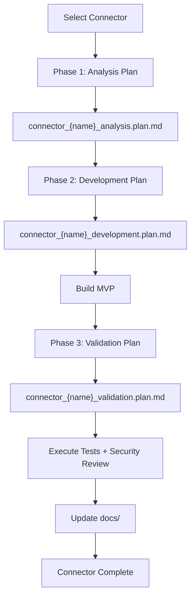

# Connector Expansion Roadmap

This plan turns every missing connector into an independent workstream following the **Research -> Develop -> Harden -> Document** lifecycle. Each connector produces 3 plan files in `.cursor/plans/`.

---

## Reference Architecture

All new connectors implement the established NAVI pattern from [connectors/connector.go](connectors/connector.go):

```go
type Connector interface {
    Name() string
    Start(ctx context.Context) error
    Stop(ctx context.Context) error
    Send(ctx context.Context, msg OutboundMessage) error
    IsRunning() bool
}
```

With optional capabilities from [connectors/capabilities.go](connectors/capabilities.go): `WebhookHandler`, `MediaSender`, `HealthChecker`, `TypingCapable`, `MessageEditor`, `ReactionCapable`, `PlaceholderCapable`, `MessageLengthProvider`.

Base pattern from [connectors/base.go](connectors/base.go): `BaseConnector` for allow-list and running state.

Registry: [internal/connectors/registry.go](internal/connectors/registry.go) -- `RegisterFactory(name, factory)`, `Create(name, cfg, bus)`.

Config: [internal/config/config.go](internal/config/config.go) -- add `XxxConfig` struct + field on `Config`.

Wiring: [cmd/navid/main.go](cmd/navid/main.go) -- register factory, extend `startConnector`.

---

## Reference Sources Per Connector

Each analysis plan compares implementations from two reference codebases:

- **OpenClaw** (TypeScript): `.example-code/openclaw/extensions/<name>/`
- **PicoClaw** (Go): upstream `pkg/channels/<name>/` (where available)

Cross-reference availability:


| Connector      | OpenClaw                       | PicoClaw              | Transport               |
| -------------- | ------------------------------ | --------------------- | ----------------------- |
| Discord        | Yes (thin + SDK)               | Yes (~500 LOC)        | Gateway WebSocket       |
| WhatsApp       | Yes (Web bridge)               | Yes (bridge + native) | WebSocket / HTTP bridge |
| Signal         | Yes (HTTP/CLI)                 | No                    | HTTP / signal-cli       |
| MS Teams       | Yes (60+ files, Bot Framework) | No                    | HTTP webhook            |
| Matrix         | Yes (70+ files, matrix-js-sdk) | No                    | WebSocket sync          |
| Mattermost     | Yes (25+ files, REST+WS)       | No                    | REST + WebSocket        |
| Feishu         | Yes (45+ files, SDK)           | Yes                   | Webhook / WebSocket     |
| LINE           | Yes (webhook)                  | Yes                   | Webhook                 |
| Google Chat    | Yes (15+ files, OAuth)         | No                    | Webhook                 |
| Nextcloud Talk | Yes (15+ files)                | No                    | Webhook                 |
| IRC            | Yes (20+ files, raw TCP)       | No                    | Raw TCP/TLS             |
| Nostr          | Yes (20+ files, relay WS)      | No                    | WebSocket (relays)      |
| Synology Chat  | Yes (12+ files)                | No                    | Webhook                 |
| Twitch         | Yes (30+ files, Twurple)       | No                    | WebSocket (Chat)        |
| Zalo           | Yes (18+ files)                | No                    | Webhook + polling       |
| BlueBubbles    | Yes (25+ files)                | No                    | Webhook                 |
| iMessage       | Yes (thin + core)              | No                    | macOS bridge            |


---

## Plan File Convention

Each connector produces 3 plan files:

```
.cursor/plans/connector_<name>_analysis.plan.md      -- Phase 1: Research
.cursor/plans/connector_<name>_development.plan.md    -- Phase 2: Develop
.cursor/plans/connector_<name>_validation.plan.md     -- Phase 3: Harden + Document
```

---

## Plan File Templates

### Analysis Plan Template (Phase 1: Research)

Each `connector_<name>_analysis.plan.md` must contain:

1. **Platform Overview** -- What the platform is, user base, API maturity, documentation quality
2. **OpenClaw Implementation Review** -- Architecture, file structure, patterns, transport mechanism, capabilities used, strengths, weaknesses
3. **PicoClaw Implementation Review** (if available) -- Same breakdown; note "N/A" if PicoClaw has no implementation
4. **Comparative Analysis** -- What each does well, where each falls short, design patterns worth adopting
5. **Platform API Assessment** -- Auth model, rate limits, message formats, media support, webhook vs polling vs WebSocket, threading model
6. **Adoptable Patterns** -- Concrete list of patterns/approaches to carry into our implementation
7. **Risk and Complexity Assessment** -- API stability, dependency weight, platform restrictions, regional considerations

### Development Plan Template (Phase 2: Develop)

Each `connector_<name>_development.plan.md` must contain:

1. **MVP Scope** -- Minimum viable connector: connect, receive messages, send messages, basic auth
2. **File Structure** -- Exact files to create under `plugins/<name>/connectors/<name>/` plus `plugins/<name>/plugin.yaml`
3. **Config Schema** -- `XxxConfig` struct fields, YAML keys, environment variable overrides
4. **Connector Implementation** -- Core struct, Start/Stop lifecycle, message handling flow
5. **Capabilities Matrix** -- Which optional interfaces to implement in MVP vs v2
6. **Integration Points** -- Registry factory, `main.go` wiring, gateway registration
7. **Message Format Mapping** -- Platform message types to NAVI `OutboundMessage` / `InboundMessage`
8. **Dependencies** -- Go libraries needed (prefer stdlib + minimal SDKs)
9. **v2 / Future Enhancements** -- Features deferred from MVP (threading, reactions, media, rich cards, etc.)

### Validation Plan Template (Phase 3: Harden + Document)

Each `connector_<name>_validation.plan.md` must contain:

1. **Unit Testing Strategy** -- Mock boundaries, table-driven tests, message parsing tests
2. **Integration Testing Strategy** -- Test harness for platform API, webhook simulation, end-to-end flow
3. **Security Analysis** -- Token/secret handling, webhook signature verification, input validation, rate limiting
4. **Secret Management** -- How credentials are stored (`store.SetSetting`), rotated, and protected
5. **Data Protection** -- PII handling, message content logging policy, data retention
6. **Threat Model** -- Spoofed webhooks, token leakage, privilege escalation, replay attacks
7. **User Documentation** -- Configuration guide, supported commands, setup instructions
8. **Technical Documentation** -- Architecture diagram, component descriptions, API surface
9. **Operational Notes** -- Deployment, monitoring, troubleshooting, health check behavior

---

## Implementation Order

### Tier 1 -- High Reach, Strong References (Start Here)

These have the most users, strongest reference implementations, and closest similarity to existing Telegram/Slack connectors.

**1. Discord**

- References: OpenClaw (thin + SDK), PicoClaw (~500 LOC Go)
- Transport: Gateway WebSocket + REST
- Complexity: Medium -- WebSocket lifecycle, gateway intents, sharding (v2)
- PicoClaw Go implementation is directly referenceable

**2. WhatsApp**

- References: OpenClaw (Web bridge), PicoClaw (bridge + native)
- Transport: WebSocket (WhatsApp Web) or Meta Cloud API (webhook + REST)
- Complexity: High -- multiple API options, session management, phone number verification
- MVP: Meta Cloud API (webhook) for simplicity

**3. Signal**

- References: OpenClaw only (HTTP/signal-cli)
- Transport: HTTP bridge to signal-cli or signald
- Complexity: Medium -- depends on external bridge process
- MVP: signal-cli REST API integration

### Tier 2 -- Enterprise / Collaboration

**4. MS Teams**

- References: OpenClaw (60+ files, Bot Framework)
- Transport: HTTP webhook (Bot Framework / Graph API)
- Complexity: High -- Azure app registration, OAuth, Adaptive Cards, conversation store
- MVP: Bot Framework webhook, direct messages, basic channel messages

**5. Matrix**

- References: OpenClaw (70+ files, matrix-js-sdk)
- Transport: Client-Server API (HTTP sync or WebSocket)
- Complexity: Medium-High -- sync protocol, room management, E2EE (v2)
- MVP: HTTP sync, DMs, room messages

**6. Mattermost**

- References: OpenClaw (25+ files)
- Transport: REST + WebSocket
- Complexity: Medium -- similar to Slack, self-hosted
- MVP: WebSocket events, REST send, basic threading

### Tier 3 -- Regional / Niche

**7. Feishu (Lark)**

- References: OpenClaw (45+ files), PicoClaw (available)
- Transport: Webhook or WebSocket (dual mode)
- Complexity: Medium-High -- Lark SDK, interactive cards, wiki/drive integration (v2)
- MVP: Webhook mode, DMs, group messages

**8. LINE**

- References: OpenClaw (webhook), PicoClaw (available)
- Transport: Webhook (Messaging API)
- Complexity: Low-Medium -- straightforward webhook, signature verification
- MVP: Webhook handler, text messages, basic media

**9. Google Chat**

- References: OpenClaw (15+ files, OAuth)
- Transport: Webhook (HTTP)
- Complexity: Medium -- OAuth service account, space/user targeting
- MVP: Webhook handler, DMs, space messages

**10. Nextcloud Talk**

- References: OpenClaw (15+ files)
- Transport: Webhook (HTTP)
- Complexity: Low-Medium -- self-hosted, signature verification
- MVP: Webhook handler, room messages

**11. IRC**

- References: OpenClaw (20+ files, raw TCP)
- Transport: Raw TCP/TLS
- Complexity: Medium -- connection management, nick registration, channel join, no native media
- MVP: TCP connection, channel messages, DMs

**12. Nostr**

- References: OpenClaw (20+ files, relay WebSocket)
- Transport: WebSocket (relay network)
- Complexity: Medium-High -- relay discovery, NIP-04 encryption, event signing, circuit breaker
- MVP: Single relay, DMs (NIP-04), basic event handling

**13. Synology Chat**

- References: OpenClaw (12+ files)
- Transport: Webhook (HTTP)
- Complexity: Low -- incoming URL, simple webhook, self-hosted NAS
- MVP: Webhook handler, send via incoming URL

**14. Twitch**

- References: OpenClaw (30+ files, Twurple)
- Transport: WebSocket (Twitch Chat / IRC-like)
- Complexity: Medium -- OAuth, channel-based, no DMs, access control
- MVP: Chat WebSocket, channel messages, basic auth

**15. Zalo**

- References: OpenClaw (18+ files)
- Transport: Webhook + polling (dual mode)
- Complexity: Medium -- Vietnamese market, group policy, proxy support
- MVP: Webhook mode, DMs, group messages

**16. BlueBubbles**

- References: OpenClaw (25+ files)
- Transport: Webhook (HTTP to BlueBubbles server)
- Complexity: Medium -- macOS dependency (BlueBubbles server), debounce, reply cache
- MVP: Webhook handler, send messages, basic media

**17. iMessage**

- References: OpenClaw (thin + core)
- Transport: macOS bridge (AppleScript / BlueBubbles)
- Complexity: High (platform constraint) -- macOS only, bridge dependency
- MVP: BlueBubbles bridge integration, DMs, basic media

---

## PicoClaw-Only Connectors (Bonus Tier)

These exist in PicoClaw but not OpenClaw. Consider for future expansion:

- **DingTalk** -- Chinese enterprise messaging (webhook/API)
- **OneBot** -- QQ bot protocol (WebSocket)
- **WeCom / WeCom App** -- WeChat Work (webhook/API)
- **QQ** -- Chinese IM

These are **not** included as active todos but should be tracked for future consideration.

---

## Workflow Per Connector




Each phase gate requires the previous plan to be complete before proceeding. Connectors within the same tier can be worked in parallel.

---

## Execution Strategy

- Work **one tier at a time**, starting with Tier 1
- Within a tier, connectors can be parallelized across workstreams
- Each connector's Phase 1 (Analysis) can begin immediately -- it is read-only research
- Phase 2 (Development) begins only after Phase 1 is reviewed
- Phase 3 (Validation) begins alongside or immediately after MVP implementation
- All plans live in `.cursor/plans/` and follow the templates above

