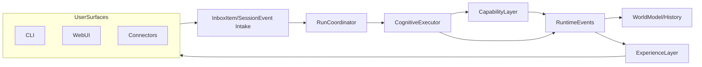
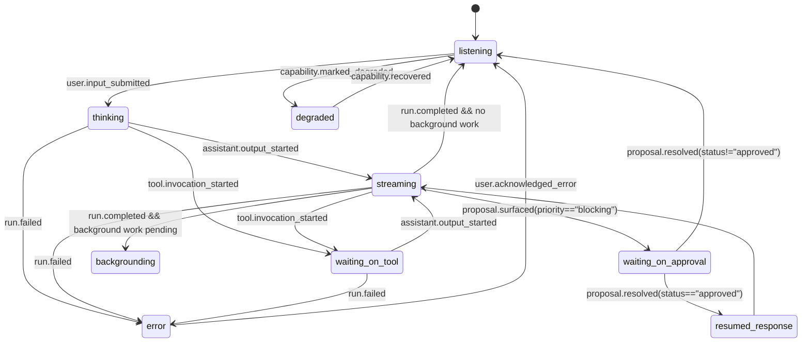

% NAVI Streaming + Messaging Architecture

**Status:** Draft  
**Scope:** Tasks 1.1–1.3 from `tasks/streaming-messaging-and-ecosystem-backlog.md` — event model, concurrency/queue semantics, and streaming UX state machine.  
**Related:** [canonical/streaming-runtime-concept.md](../canonical/streaming-runtime-concept.md) · [canonical/conceptual-design-overview.md](../canonical/conceptual-design-overview.md) · [design/streaming-runtime.md](../design/streaming-runtime.md) · [design/delayed-and-multi-message.md](../design/delayed-and-multi-message.md) · [tasks/streaming-messaging-and-ecosystem-backlog.md](../tasks/streaming-messaging-and-ecosystem-backlog.md)

---

## 1. Scope and Non-Goals

**In-scope:**

- **Canonical session event model and envelope** used across CLI, web UI, and messaging connectors.
- **Event taxonomy** for:
  - user input started/updated/submitted
  - assistant response started/chunk/completed/cancelled
  - tool invocation started/progress/completed/failed
  - proposal surfaced/updated/resolved
  - interruption/correction
  - background task state updates
- **Multi-message concurrency and queue semantics**:
  - per-session queues and priorities for foreground vs background work
  - interrupt/merge/supersede/defer/reject rules tied to Proposal Queue and interruption model
- **Streaming UX state machine**:
  - user-visible states and transitions
  - mapping from runtime events to UX state for CLI and web
  - rules for token-stream vs semantic event surfacing

**Out-of-scope (for this spec; covered elsewhere or future work):**

- LLM-side reasoning policies, proposal generation heuristics, and governance decision logic (see [canonical/conceptual-design-overview.md](../canonical/conceptual-design-overview.md)).
- Concrete DB schema migration steps, NATS subject renames, and runtime package refactors (see [design/streaming-runtime.md](../design/streaming-runtime.md) and future ADRs).
- Web UI visual design, layout, and component library choices (see future Web UI specs).
- Ecosystem/marketplace registry behavior beyond the metadata needed to express events and state.

---

## 2. Architecture and Data Flow

### 2.1 Layer Integration

Streaming + messaging sit at the **transport and event semantics boundary** between layers:

- **Experience Layer**: maps event streams into UX state (`listening`, `thinking`, `streaming`, etc.) and presentation; does not own reasoning.
- **Cognitive Layer**: consumes normalized events (`SessionEvent`), drives the run lifecycle, issues commands, and writes history.
- **World Model**: persists events, runs, proposals, history, and execution outcomes; is the substrate for replay and resumability.
- **Capability Layer**: tools, connectors, and plugins emit tool and background task events; they never write to the World Model directly.

High-level flow (logical, not package-accurate):

### 2.2 Session, Turn, Message, Event

This spec assumes the following logical entities (some already exist, some will be added/extended in `internal/schema`):

- **Session**: conversational context between owner and NAVI (`session_id`).
- **Turn**: logical foreground engagement within a session; may span multiple messages and events.
- **Message**: user or assistant message (possibly multi-part) as seen by the Experience Layer.
- **Run**: execution unit for a foreground turn, as per [design/streaming-runtime.md](../design/streaming-runtime.md).
- **Event**: atomic, timestamped change in runtime state; events are the primary streaming primitive.

Identifiers:

- `session_id`: stable per conversation surface.
- `run_id`: stable per foreground execution run (see `RunState` in [design/streaming-runtime.md](../design/streaming-runtime.md)).
- `message_id`: stable per logical message; assistant messages may be assembled from many output chunk events.
- `event_id`: monotonically increasing (per session or per store) logical identifier for event ordering and replay.

Events always carry enough correlation to tie them back to the appropriate `session_id`, `run_id`, and (when applicable) `message_id`, `tool_call_id`, or `proposal_id`.

---

## 3. Canonical Event Envelope and Taxonomy (Task 1.1)

### 3.1 Event Envelope

All streaming and runtime events share one canonical envelope. Concrete field names and JSON tags are defined in `internal/schema`, but the logical shape is:

- **Logical struct** (`SessionEvent` / `Event`):
  - `id` (`event_id`)
  - `type` (event type string, see taxonomy below)
  - `session_id`
  - `run_id` (optional; empty for purely background events)
  - `origin` (e.g. `cli`, `web`, `telegram`, `system`, `subconscious`)
  - `ts` (RFC3339 timestamp)
  - `seq` (monotonic per-session or per-store sequence number for replay)
  - `visibility` (`user_visible` | `operator_visible` | `audit_only`) as per [design/streaming-runtime.md](../design/streaming-runtime.md)
  - `payload` (type-specific JSON object)
  - `correlation`:
    - `message_id` (when this event contributes to a user/assistant message)
    - `tool_call_id` (when this event represents a tool invocation)
    - `proposal_id` (when this event is proposal-related)

**Evolution rules:**

- Envelope fields are additive and backward-compatible:
  - new fields default to `omitempty` at the encoding layer;
  - versioning is handled at the schema level (`SchemaVersion`) as in [design/streaming-runtime.md](../design/streaming-runtime.md).
- `payload` is **type-specific but schemaed**: each event type has a typed payload struct in `internal/schema`, even if clients treat it generically.
- Consumers must:
  - match on `type` and treat unknown fields as opaque;
  - ignore unknown event types where possible, or surface them as generic telemetry.

### 3.2 Event Taxonomy

The taxonomy below groups events by functional category; each bullet is a logical event type (e.g. `user.input_started`), not yet a Go constant.

#### 3.2.1 User Input Events

- `user.input_started`
  - Emitted when a surface begins capturing user input (e.g. CLI prompt activation, web text area focus, connector “typing started”).
- `user.input_updated`
  - Emitted on significant edit to in-progress input (e.g. for multi-line drafts, long-form content).
- `user.input_submitted`
  - Emitted once when input is committed and becomes an `InboxItem` / `History` record.

Minimal payload fields:

- `input_id`
- `content_preview` (optional; truncated for privacy/sizing)
- `channel` (`cli`, `web`, `telegram`, etc.)

#### 3.2.2 Assistant Streaming Events

- `assistant.output_started`
- `assistant.output_chunk`
- `assistant.output_completed`
- `assistant.output_cancelled`

Payload:

- `message_id`
- `chunk` (for `output_chunk`; raw token/text delta or semantic block identifier)
- `final_content` (for `output_completed`, when assembled)
- `cancel_reason` (for `output_cancelled`)

These events **do not** own reply shaping; they carry raw content (and optionally semantic block annotations) for Experience to project.

#### 3.2.3 Tool Lifecycle Events

Complementing `EventToolCall*` in [design/streaming-runtime.md](../design/streaming-runtime.md):

- `tool.invocation_started`
- `tool.invocation_progress`
- `tool.invocation_completed`
- `tool.invocation_failed`

Payload:

- `tool_call_id`
- `tool_name`
- `args_preview` (sanitized)
- `progress` (percentage or step index, optional)
- `error` (structured, for `failed`)

#### 3.2.4 Proposal Events

Aligned with Proposal Queue in [canonical/conceptual-design-overview.md](../canonical/conceptual-design-overview.md):

- `proposal.surfaced`
- `proposal.updated`
- `proposal.resolved`

Payload:

- `proposal_id`
- `priority` (`blocking` | `queued`)
- `status` (`pending` | `approved` | `declined` | `expired` | `superseded`)
- `summary` (UX-facing rationale)

#### 3.2.5 Interruption/Correction Events

Reflecting the interruption rules in [canonical/conceptual-design-overview.md](../canonical/conceptual-design-overview.md):

- `interaction.interrupted`
- `interaction.corrected`

Payload:

- `interrupt_id`
- `mode` (`advisory` | `blocking`)
- `reason`
- `affected_run_id`

#### 3.2.6 Background Task Events

For tasks and runs not currently in the foreground:

- `task.status_updated`
- `task.log_appended`

Payload:

- `task_id`
- `status`
- `summary` / `log_line`

### 3.3 Surface-Specific Protocol Notes

The envelope and taxonomy above are **canonical**; surfaces adapt them as follows:

- **CLI:**
  - primary transport is local process I/O; event stream is exposed either as:
    - newline-delimited JSON events on a machine-readable channel; or
    - a local WebSocket connection to `navid` that the CLI subscribes to.
  - CLI UX projects events into compact textual states (`…`, “thinking”, “waiting on tool X”, etc.).

- **Web UI:**
  - subscribes over WebSocket (or SSE in degraded mode) to the canonical event stream, filtered by `session_id`.
  - replay uses `seq` and `event_id` as `replay_from` cursor parameters.

- **Connectors:**
  - map relevant events into their own native message/edit semantics (e.g. edited messages for Telegram during streaming).
  - must preserve `event_id` / `run_id` / `message_id` in connector metadata where possible for debugging and replay.

---

## 4. Multi-Message Concurrency and Queue Semantics (Task 1.2)

### 4.1 Queue Model

Per-session queues exist conceptually within the runtime:

- `foreground_session_queue`:
  - intake of user-submitted messages and high-priority system events for an active session.
  - at most **one active foreground run** per session, enforced by the runtime as in [design/streaming-runtime.md](../design/streaming-runtime.md).
- `background_event_queue`:
  - lower-priority events such as background task updates and non-urgent notifications.
- `proposal_queue`:
  - canonical queue defined in [canonical/conceptual-design-overview.md](../canonical/conceptual-design-overview.md) (`Proposal Queue` section).

Ordering guarantees:

- Within a given `session_id`:
  - events are totally ordered by `(ts, seq)`;
  - foreground events may **delay** but not reorder each other.
- Cross-session ordering is not guaranteed; consumers treat sessions independently.

Maximum in-flight:

- At most one `run_id` with `foreground` mode is active for a session.
- Background runs (future work) may exist concurrently but must not starve the foreground scheduler.

### 4.2 Priority Model

Logical priority tiers from the backlog map to concrete behavior:

- **Active user turn**:
  - highest priority; new `user.input_submitted` events generally start or steer the active run.
- **Urgent subconscious correction**:
  - may pre-empt ongoing work according to the strict interruption rules.
- **Blocking proposal**:
  - pauses a run; Proposal becomes a gating item in the Proposal Queue.
- **Queued proposal**:
  - recorded and surfaced but does not block current execution.
- **Background status event**:
  - lowest priority; processed opportunistically.

Priority influences:

- scheduling decisions in the runtime dispatcher;
- which events can trigger **interrupt**, **defer**, or **supersede** actions (see below).

### 4.3 Interrupt / Merge / Supersede / Defer / Reject

The queue classifier (see Phase 5 in [design/streaming-runtime.md](../design/streaming-runtime.md)) applies these actions to incoming items:

- **merge**:
  - coalesce bursty user messages into a single logical input (e.g. rapid corrections within a 2–5s window).
  - typical for `user.input_updated` while the input is not yet submitted.

- **supersede**:
  - replace a pending but unprocessed input with a newer one (e.g. the user edits a message before it is consumed).
  - prevents the system from acting on stale intent.

- **interrupt**:
  - for high-priority events (e.g. urgent subconscious correction, explicit user “stop” command).
  - triggers an `interaction.interrupted` event targeting the current `run_id`.
  - foreground run transitions to `cancelled` or `paused` depending on recovery rules in [design/streaming-runtime.md](../design/streaming-runtime.md).

- **defer**:
  - hold lower-priority events (e.g. queued proposals or background info) until a safe boundary (after current run completes or pauses).

- **reject**:
  - explicit backpressure: new input is refused with a clear error when system is saturated or policy forbids concurrent runs.

**Alignment with Proposal Queue and interruptions:**

- When an event would change world state in a way that requires confirmation:
  - the runtime **does not** execute immediately;
  - it emits `proposal.surfaced` and queues the Proposal as `blocking` or `queued`.
- When an urgent subconscious correction occurs mid-run:
  - classifier raises an `interrupt` targeting the run;
  - Cognitive executor surfaces `interaction.interrupted` and either:
    - adjusts the plan within the same run; or
    - terminates and starts a new run informed by corrected state.

No queue action is ever delegated to prompts; they are deterministic runtime decisions.

---

## 5. Streaming UX State Machine (Task 1.3)

### 5.1 UX State Definitions

User-visible states (per session) are:

- `listening`: NAVI is ready to accept input; no active foreground run.
- `thinking`: input has been submitted; runtime is in an active run but has not produced user-visible output yet.
- `streaming`: assistant output is being streamed to the user.
- `waiting_on_tool`: runtime is blocked on tool invocation (no new assistant tokens).
- `waiting_on_approval`: a blocking Proposal is required before proceeding.
- `backgrounding`: work related to the last interaction continues in the background, but foreground is idle.
- `resumed_response`: a previously paused run has resumed streaming.
- `error`: foreground run failed but the system is still healthy.
- `degraded`: one or more capabilities are degraded (e.g. connector unavailable), as per failure model.

### 5.2 State Machine

Logical state machine (per session) driven by events:

CLI and web both consume this single state machine; they differ only in how they visualize each state.

### 5.3 Event → UX State Mapping

At a high level, Experience derives state from the event stream:

- `user.input_submitted` → `thinking` (if no active run) or queues/steers per concurrency rules.
- `assistant.output_started` → `streaming`.
- `assistant.output_chunk` → remains `streaming`.
- `assistant.output_completed`:
  - if `run.completed` follows with no background work → `listening`;
  - if delayed messages scheduled → remain `streaming` until last message, then `backgrounding` or `listening`.
- `tool.invocation_started` with no active streaming → `waiting_on_tool`.
- `proposal.surfaced` with `priority=blocking` → `waiting_on_approval`.
- `run.failed` → `error`.
- `capability.degraded` (from failure model) → `degraded`.

The mapping is deterministic: given `(current_state, incoming_event_type)` Experience can compute the next state.

### 5.4 Token Streaming vs Semantic Summaries

Different event patterns support different UX granularity:

- **Token-level streaming**:
  - `assistant.output_chunk` carries raw deltas; used when:
    - latency is critical (coding, shell, debugging);
    - user expects continuous output.
- **Semantic block streaming**:
  - `assistant.output_chunk` may carry higher-level markers (paragraph IDs, code block IDs);
  - Experience can choose to buffer until a block completes before rendering.
- **Summary-only**:
  - for background task updates and noisy logs, Experience may only surface:
    - aggregated `task.status_updated`;
    - summary payloads on `run.completed` and `proposal.resolved`.

Configuration hooks:

- Per-surface and per-role policies (e.g. Coder vs Assistant vs Character) decide:
  - whether to show raw tokens or only semantic blocks;
  - whether to stream all tool logs or collapse into a single “waiting on tool X…” state.
- These policies live in Experience; they do not change event types or payloads.

---

## 6. Implementation Notes and Follow-On Work

This spec is intentionally runtime- and schema-facing but does **not** prescribe exact Go types or package boundaries; those are defined in:

- [design/streaming-runtime.md](../design/streaming-runtime.md) (runtime packages and phases),
- [canonical/streaming-runtime-concept.md](../canonical/streaming-runtime-concept.md) (historical conceptual plan),
- and future ADRs for any breaking schema or protocol changes.

For Tasks 1.1–1.3 the next concrete implementation steps are:

- Extend `internal/schema` event types and payloads to cover the taxonomy above.
- Ensure gateway streaming endpoints (HTTP + WebSocket) expose the canonical envelope.
- Implement queue classifier rules for merge/supersede/interrupt/defer/reject in the runtime.
- Add Experience-layer state projection based on the UX state machine so CLI and web can render consistent streaming behavior.

